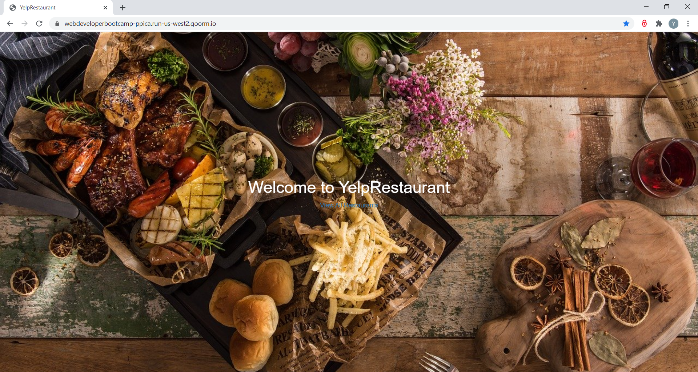
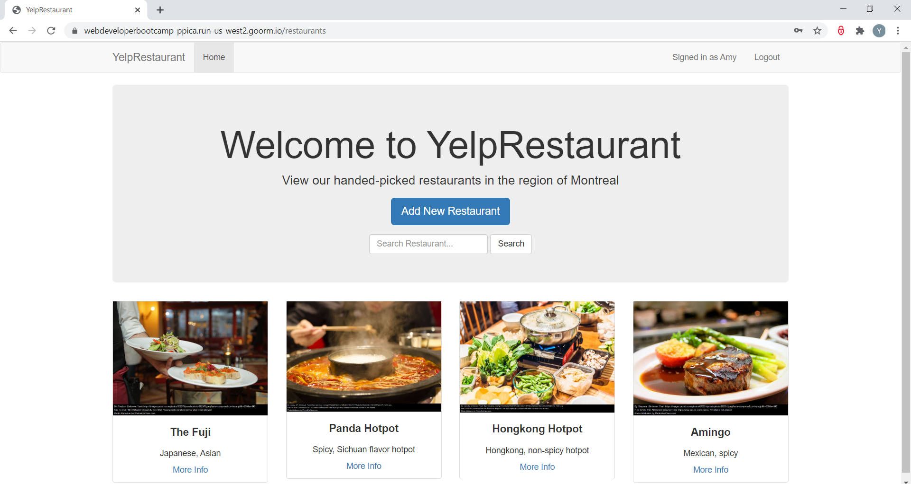
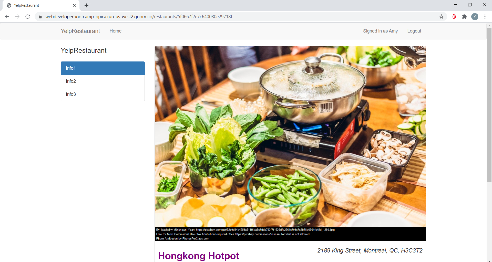
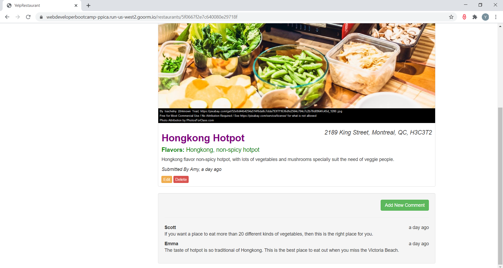
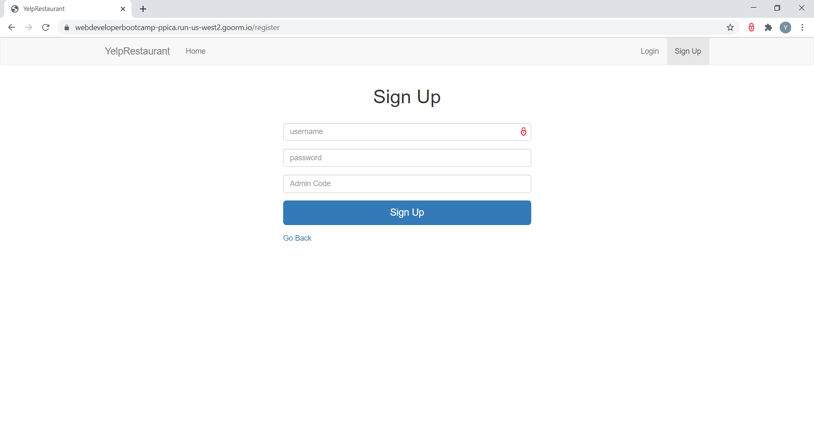
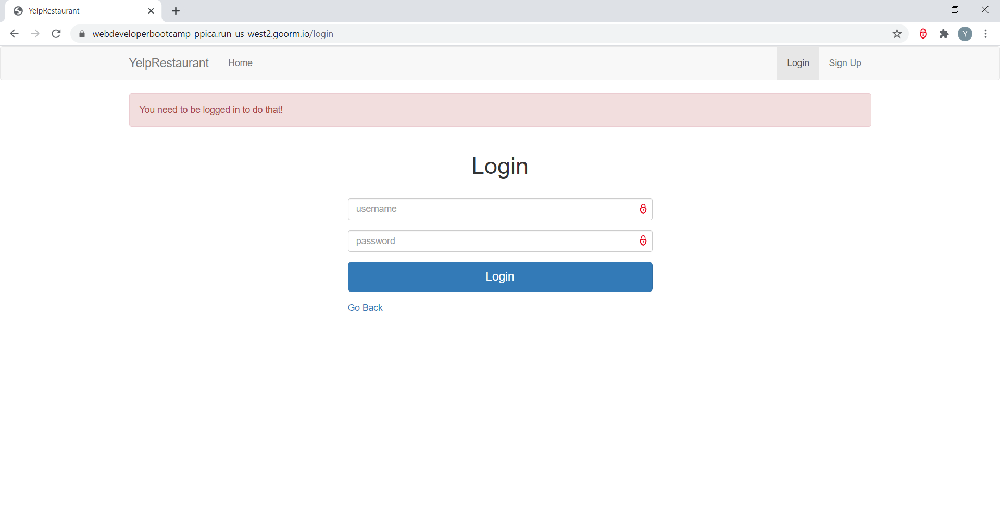
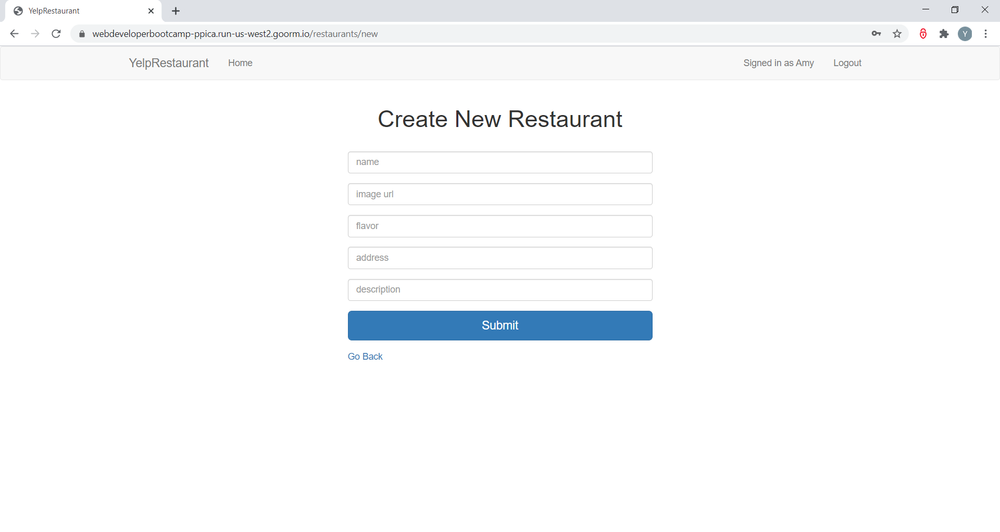
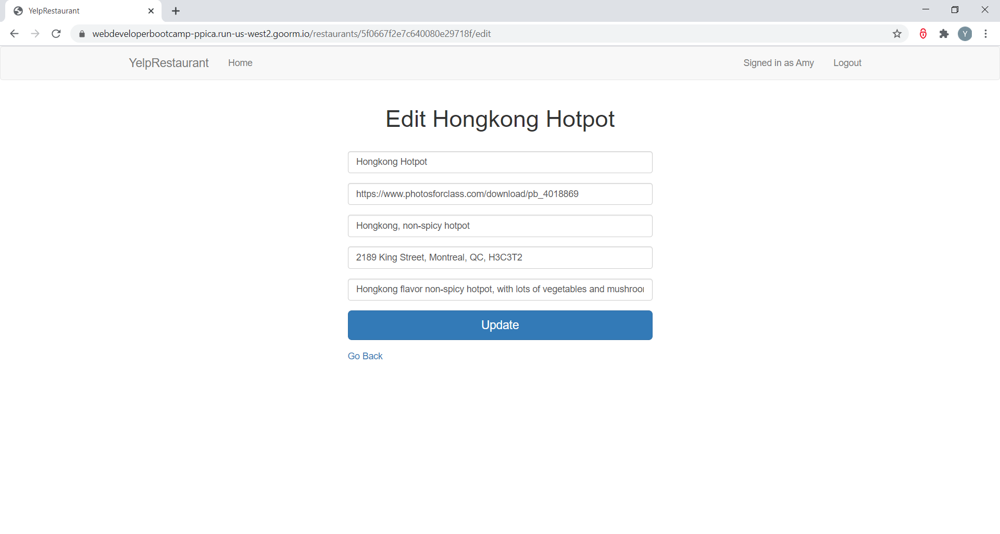
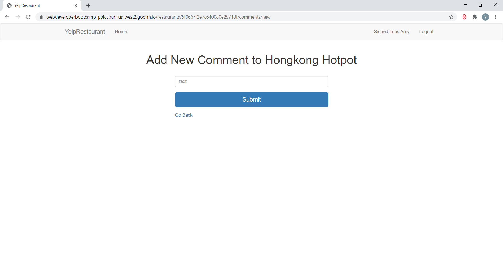
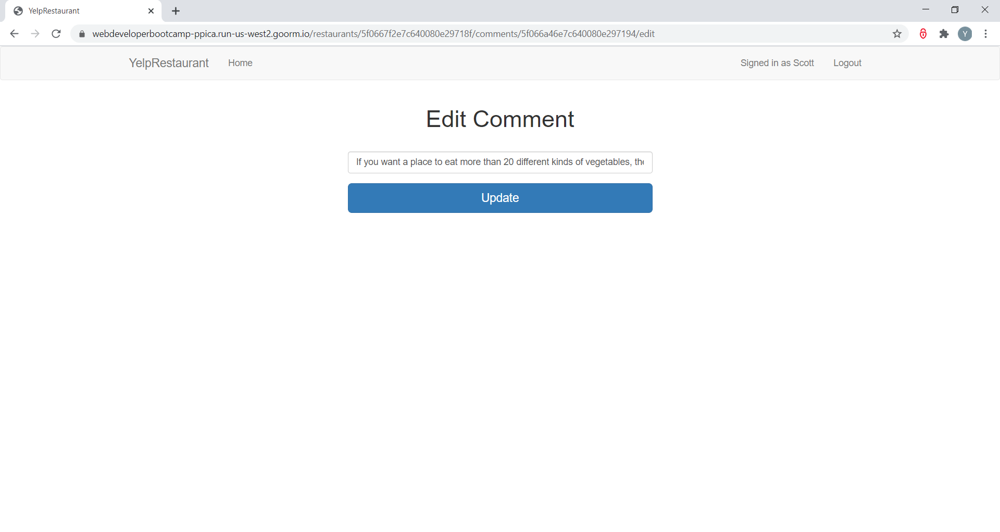

# YelpRestaurant
<ul>
  <li> A RESTful style Web application that allows users to share their reviews of restaurants by uploading photos and comments. </li>
  <li> Front-end was implemented with JavaScript, HTML5, CSS and Bootstrap. </li>
  <li> Back-end was implemented with Node.js and Express, and utilized MongoDB for data management. </li>
  <li> User authentication and authorization was implemented by Passport.js. </li>
  <li> The web application has been deployed and supported on Heroku (https://restaurant-review-85305.herokuapp.com/). </li>
</ul>

  <h3> Animated landing pages </h3>
  
  
  
  

  <h3> Home page displays all restaurants and allows fuzzy search</h3>
  
  
  

  <h3> Show page displays detail information about chosen restaurant and allows modification by author of the restaurant/comments </h3>
  
  
  
  

  <h3> User register page</h3>
  
  
  

  <h3> User login page</h3>
  
  
  

  <h3> Add new restaurant page</h3>
  
  
  

  <h3> Modify restaurant page</h3>
  
  
  

  <h3> Add new comment page</h3>
  
  
  

  <h3> Modify comment page</h3>
  
 

