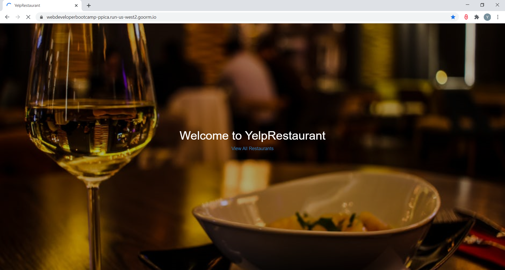

# YelpRestaurant
<ul>
  <li> A RESTful style Web application that allows users to share their reviews of restaurants by uploading photos and comments. </li>
  <li> Front-end is implemented with JavaScript, HTML5, CSS and Bootstrap. </li>
  <li> Back-end is implemented with Node.js and Express, and utilized MongoDB to store user’s archives. </li>
  <li> User authentication and authorization is implemented by Passport.js. </li>
</ul>

  <h3> animated landing page </h3>
    
 

